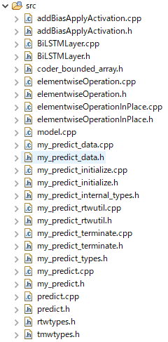
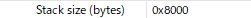
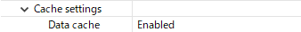

# AIonMCU
Inference simple AI model on MCU (Cortex M)

## Training model
Reference from [here](https://www.mathworks.com/help/predmaint/ug/anomaly-detection-using-3-axis-vibration-data.html)

## Generate predict model to C++
1. Write an entry-point function in MATLAB that:
```matlab
function out = my_predict(in)

persistent mynet;
if isempty(mynet)
    mynet = coder.loadDeepLearningNetwork('Net.mat');
end

out = predict(mynet,in,'MiniBatchSize',2); 
```
2. Create a dlconfig that is configured for generating generic C/C++ code by using the coder.DeepLearningConfig function.
```matlab
dlconfig = coder.DeepLearningConfig(TargetLibrary='none');
```
Create a code generation configuration object for MEX, executable, or static or dynamically linked library:
```matlab
cfg = coder.config('lib');
cfg.TargetLang = 'C++';
cfg.DeepLearningConfig = dlconfig;
```
3. Run the codegen command
```matlab
codegen -config cfg my_predict -args {testNormal} -report
```

## Porting for [RA8M1](https://www.renesas.com/jp/ja/products/microcontrollers-microprocessors/ra-cortex-m-mcus/ra8m1-480-mhz-arm-cortex-m85-based-microcontroller-helium-and-trustzone)

1. copy all file `*.cpp` and `*.h` in generate folder to folder `src` of e2studio project:

    

    copy `tmwtypes.h` to `src` folder

2. Config project:
   
    Stack size is 32kB:
   
    

    Enable Data Cache:

    


## Result
|   TestCase   |   Time [ms]   |
| :----------: | :-----------: |
| w/ Data Cache|   6.374       |
| wo/ Data Cache|  19.363      |

## Reference
https://www.mathworks.com/help/predmaint/ug/anomaly-detection-using-3-axis-vibration-data.html
https://www.mathworks.com/help/coder/ug/generate-generic-cc-code-for-deep-learning-networks.html
